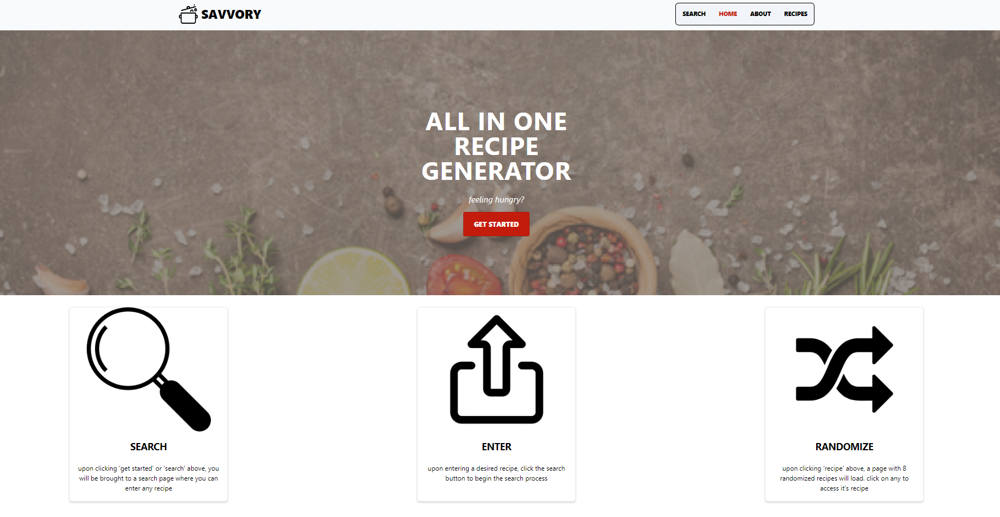
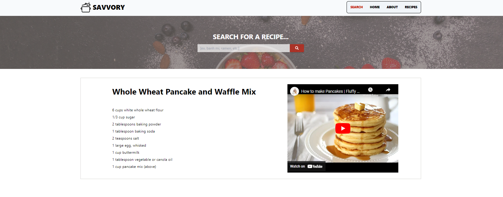
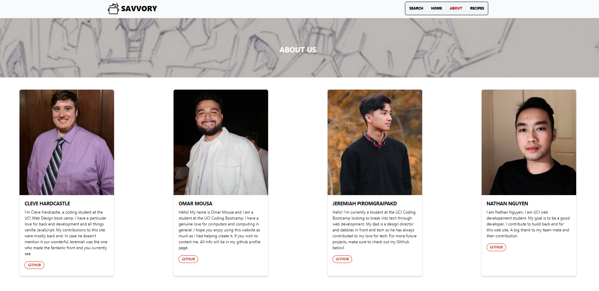
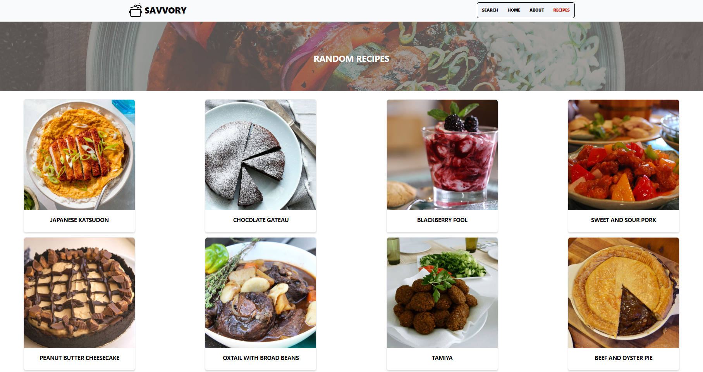

# SAVVORY

## DESCRIPTION 

This web based application will search through two different APIs to return results from both a recipe API and YouTube’s API for both a text recipe and a video tutorial of whatever dish you’re looking to cook. 

## USAGE

To use the application simply navigate to it’s live link at: https://nathannguyen0102.github.io/foodRecipe/index.html

Click onto the search bar and type in whatever recipe you desire to get directions/tutorials for. 

Hit enter and see the results displayed!

Click on the Recipe tab if you'd like some random recipe ideas! Click on an image to be taken to the recipe website. 

## COLLABORATORS 

Nathan -  https://github.com/nathannguyen0102

Cleve - https://github.com/CleveHardcastle

Jeremiah - https://github.com/cytoplasma

Omar - https://github.com/omousa98

## LICENSE 

MIT License

Copyright (c) 2022

Permission is hereby granted, free of charge, to any person obtaining a copy
of this software and associated documentation files (the "Software"), to deal
in the Software without restriction, including without limitation the rights
to use, copy, modify, merge, publish, distribute, sublicense, and/or sell
copies of the Software, and to permit persons to whom the Software is
furnished to do so, subject to the following conditions:

The above copyright notice and this permission notice shall be included in all
copies or substantial portions of the Software.

THE SOFTWARE IS PROVIDED "AS IS", WITHOUT WARRANTY OF ANY KIND, EXPRESS OR
IMPLIED, INCLUDING BUT NOT LIMITED TO THE WARRANTIES OF MERCHANTABILITY,
FITNESS FOR A PARTICULAR PURPOSE AND NONINFRINGEMENT. IN NO EVENT SHALL THE
AUTHORS OR COPYRIGHT HOLDERS BE LIABLE FOR ANY CLAIM, DAMAGES OR OTHER
LIABILITY, WHETHER IN AN ACTION OF CONTRACT, TORT OR OTHERWISE, ARISING FROM,
OUT OF OR IN CONNECTION WITH THE SOFTWARE OR THE USE OR OTHER DEALINGS IN THE
SOFTWARE.

## SCREENSHOTS

